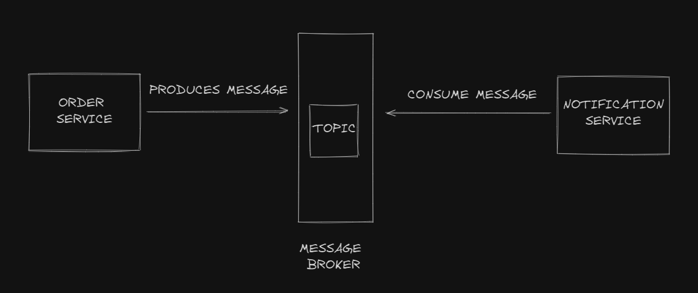

# POC Kafka

## Overview
This project implements a simple order and notification system:


## Dependencies
* [Spring for Apache Kafka](https://docs.spring.io/spring-boot/docs/3.3.4/reference/htmlsingle/index.html#messaging.kafka): a messaging system that facilitates asynchronous communication between application components.

## Getting Started
1. **Clone the Repository:**
```bash
git clone https://github.com/pedrokmra/poc-kafka.git
```

2. **Run:**
```bash
docker-compose up
```